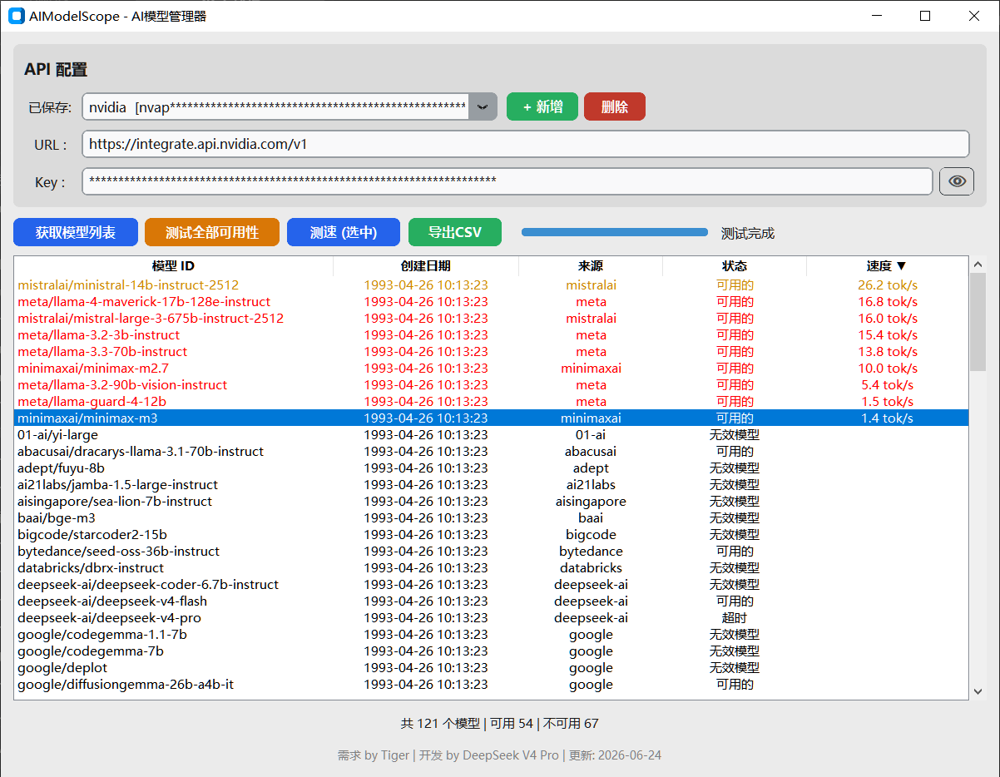

# AIModelScope

[English](#english) | [中文](#chinese)

---

<a name="english"></a>
## English

**AIModelScope** is a desktop GUI tool for browsing and testing models from any OpenAI-compatible API provider.

### Features

- **Multi-Provider** — Connect to any OpenAI-compatible API (OpenAI, Anthropic via proxy, Ollama, LM Studio, AxonHub, etc.)
- **Model List** — Browse all available models with creation date and provider info
- **Availability Test** — Batch test all models to check which ones are working (5 concurrent threads)
- **Speed Test** — Measure token generation speed (tokens/second) with color-coded results
- **CSV Export** — Export model list with status and speed data
- **API Config Management** — Save multiple API configurations securely on your local machine
- **Sort & Filter** — Click column headers to sort ascending/descending

### 🔒 Privacy & Security

- **All API keys are stored ONLY on your local computer** in `api_configs.json`
- **Nothing is ever sent anywhere except to the API endpoint you configure**
- **The source code contains NO hardcoded API keys or credentials**
- **Zero telemetry, zero analytics, zero data collection**

### Screenshot



### Download

Download the latest `AIModelScope.exe` from [Releases](https://github.com/AIModelScope/AIModelScope/releases).

### Run from Source

```bash
git clone https://github.com/AIModelScope/AIModelScope.git
cd AIModelScope
pip install -r requirements.txt
python aimodelscope.py
```

### Build EXE

```bash
pip install pyinstaller customtkinter requests
pyinstaller --onefile --windowed --name AIModelScope --collect-data customtkinter aimodelscope.py
# EXE will be in ./dist/
```

### License

MIT License - see [LICENSE](LICENSE) file.

### Credits

- Built with [CustomTkinter](https://github.com/TomSchimansky/CustomTkinter)
- Powered by Python

---

<a name="chinese"></a>
## 中文

**AIModelScope** 是一个桌面 GUI 工具，用于浏览和测试任何 OpenAI 兼容 API 提供商的 AI 模型。

### 功能

- **多平台支持** — 连接任意 OpenAI 兼容 API（OpenAI、Anthropic 代理、Ollama、LM Studio、AxonHub 等）
- **模型列表** — 浏览所有可用模型，显示创建日期和来源信息
- **可用性检测** — 批量测试所有模型是否可用（5 线程并发）
- **速度测试** — 测量 token 生成速度（tokens/s），颜色标注快慢
- **导出 CSV** — 导出含状态和速度数据的模型列表
- **API 配置管理** — 安全保存多个 API 配置在本地电脑
- **排序** — 点击表头可升序/降序排列

### 🔒 隐私与安全

- **所有 API Key 仅保存在您的本地电脑**的 `api_configs.json` 文件中
- **不会向任何第三方发送数据**，所有请求仅发送到您配置的 API 地址
- **源代码不包含任何硬编码的 API Key 或凭证**
- **零遥测、零分析、零数据收集**

### 截图


### 下载

从 [Releases](https://github.com/AIModelScope/AIModelScope/releases) 下载最新 `AIModelScope.exe`。

### 从源码运行

```bash
git clone https://github.com/AIModelScope/AIModelScope.git
cd AIModelScope
pip install -r requirements.txt
python aimodelscope.py
```

### 构建 EXE

```bash
pip install pyinstaller customtkinter requests
pyinstaller --onefile --windowed --name AIModelScope --collect-data customtkinter aimodelscope.py
# EXE 在 ./dist/ 目录下
```

### 许可证

MIT License - 详见 [LICENSE](LICENSE) 文件。

### 致谢

- 基于 [CustomTkinter](https://github.com/TomSchimansky/CustomTkinter) 构建
- Python 驱动
